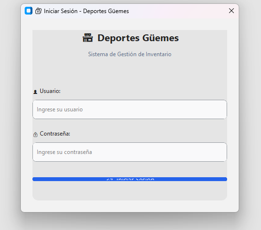
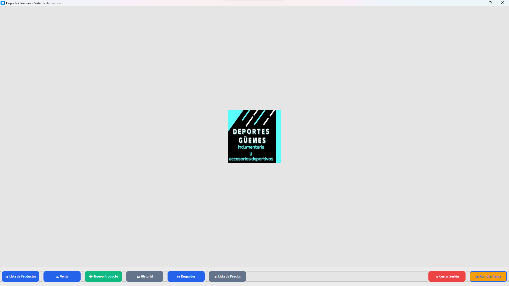
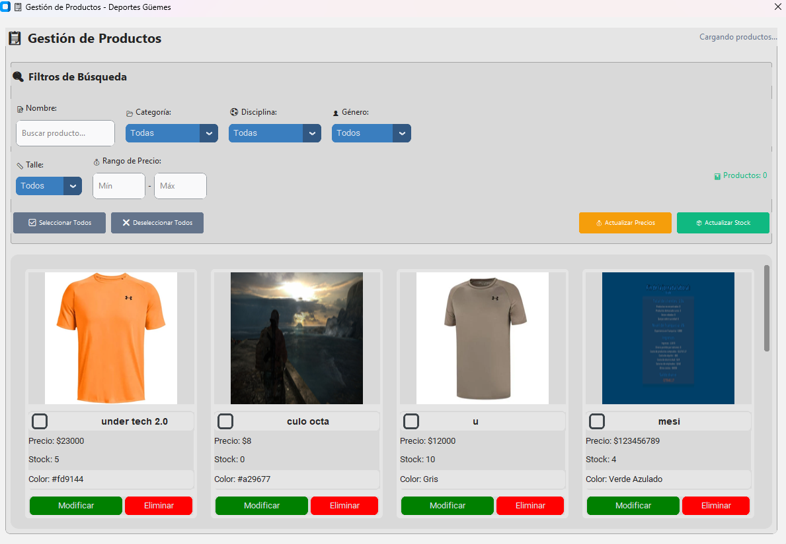

 quiero que el boton de iniciar sesion este completo, sale como aplastado
 quiero q el menu este arriba de la imagen, y la imagen no sale a pantalla completa. me gustaria que la imagen este a pantalla completa.
 El label cargando productos siepre queda ahi, y por ahi estaria bueno que los filtros no esten siempre ahi ocupando espacio, asi q habria q ponerlos en un boton y que aparezcan cuando los necesitas
